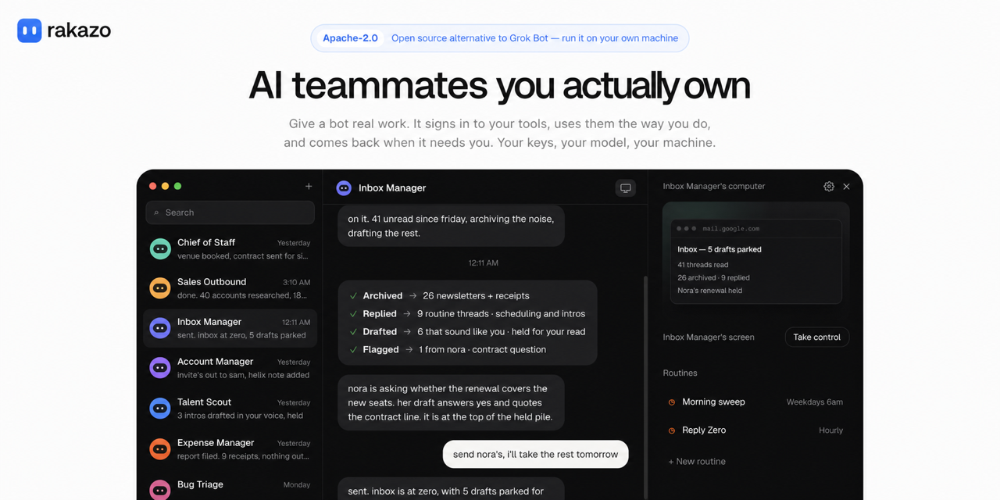

# FlowBots

> **FlowBots is a modified and customized version of [Rakazo](https://github.com/elie222/rakazo), created by [Elie Steinbock (@elie222)](https://github.com/elie222). Huge thanks to Elie and the Rakazo contributors for open-sourcing the original project and giving this fork such a strong foundation.**



**FlowBots** is a local-first, open-source Grok Bots-style agent workspace built on Rakazo, expanded with per-bot computers, local AI/model support, bounded bot-to-bot collaboration and reactions, optional Mnemosyne recall, and a self-contained macOS Lite runtime.

**No account sign-up is required for the recommended FlowBots Lite desktop mode.** Lite automatically creates and signs into a local-only workspace identity on your Mac. You only connect or select the AI model(s) you want to use.

Web, desktop, and mobile are still supported. Bring your own AI and sandbox. This fork remains early/beta software.

Each bot has one thread, one computer, memory, routines, and history. A bot can also spawn more bots — each a regular peer with its own thread and computer — or run short-lived subagents inside the current turn. This repository is the complete core product — it runs without a Rakazo-operated control plane.


## Stack

- TypeScript
- React 19, Vite, Tailwind
- Electron
- Expo
- Hono, oRPC
- Postgres, Prisma
- Better Auth
- Graphile Worker
- Pi
- Any sandbox provider (tested with Docker and E2B)
- Composio
- Optional Mnemosyne local semantic memory

## Requirements

- Node.js 22+
- pnpm 9
- Docker Desktop (Postgres plus the graphical bot computer)
- Optional for semantic memory: Python 3.10+ with `mnemosyne-memory==3.15.1`

## Run locally (web)

From the repo root:

```bash
cp .env.example .env
```

Edit `.env`:

- Set `BETTER_AUTH_SECRET` and `ENCRYPTION_KEY` to long random strings before any network exposure. Placeholder values only work in local `development` / `test` runs.
- Put your OpenRouter key in `OPENROUTER_API_KEY` (or skip the key and paste one during onboarding).
- ChatGPT Plus or Pro, GitHub Copilot, or SuperGrok / X Premium: skip the key and sign in on the **Connect a model** screen. Pick **OpenAI Codex**, **GitHub Copilot**, or **xAI**, then sign in with the device code Pi shows. Claude Pro is not in the Rakazo UI yet — Pi's Claude login opens a localhost callback, which does not work from the web app.
- Optional: `COMPOSIO_API_KEY` if you want Plugins to talk to live apps.
- Optional: install Mnemosyne for local semantic recall. The default `MNEMOSYNE_MODE=auto` uses it when available and falls back to the canonical Markdown memory store when it is not.

To enable the tested Mnemosyne release:

```bash
python3 -m pip install "mnemosyne-memory==3.15.1"
```

Advanced Mnemosyne controls are `MNEMOSYNE_MODE=auto|off|required`, `MNEMOSYNE_COMMAND=/path/to/mnemosyne`, and `MNEMOSYNE_TIMEOUT_MS` (500–60000 ms, default 5000). Rakazo stores each derived semantic index in an opaque, per-user/workspace/scope directory under `DATA_DIR/mnemosyne-index/`. Those SQLite indexes are rebuildable caches; Markdown/Brain memory remains the authoritative, portable source of truth.

Then:

```bash
docker compose -f infra/compose/docker-compose.yml up postgres -d
pnpm install
pnpm db:generate
pnpm db:migrate
pnpm sandbox:build
pnpm dev
```

`pnpm dev` starts the API (`:3100`), Graphile Worker, Vite web app (`:5173`), and sandbox supervisor (`:7091`).

Open [http://127.0.0.1:5173](http://127.0.0.1:5173). The full web/server mode retains Rakazo's normal account authentication; for the no-sign-up local experience, use the packaged FlowBots desktop app in **Lite** mode, which provisions the local-only workspace identity automatically. In web/server mode, sign up, pick a model from the Pi catalog (paste an API key, sign in with ChatGPT / Copilot / SuperGrok, or Skip if the deployment key is set), create a bot, and send a message. The computer pane is a live Linux desktop. The model can observe and control the screen, use browsers and other graphical applications, run terminal commands, and work with files. You can interact with the same desktop while it runs; taking control makes the viewer editable but does not impose an exclusive agent/user lock. Ask a bot to spawn another bot, or to run a subagent for work that should stay inside this turn.

### Venice AI and G0DM0D3 research routing

The model catalog also supports **Venice AI** through its OpenAI-compatible API and **Pliny G0DM0D3** through a local/self-hosted OpenAI-compatible endpoint. Paste the corresponding provider key during model setup. G0DM0D3 defaults to `http://127.0.0.1:7860/v1` and can be redirected with `GODMODE_BASE_URL`; environment-key deployments can use `VENICE_API_KEY` and `GODMODE_API_KEY`.

Rakazo does not rewrite prompts into jailbreaks or retry providers merely because a model refused a request. When the user has connected the relevant providers, ordinary prompts stay on the normal default model, high-control/tool-capable research and cybersecurity prompts can prefer Venice, and explicit G0DM0D3 / ULTRAPLINIAN / CONSORTIUM / multi-model requests can prefer G0DM0D3.

Confirm the product path:

```bash
curl -s http://127.0.0.1:3100/health
```

You want `"runtime":"pi"`, `"sandbox":"docker"`, `"jobs":"graphile"`, `"realtime":"postgres"`, `"memory":"markdown+mnemosyne"`, and normally `"mnemosyne":"auto"`. `"composio":true` only if the Composio key is set.

Product defaults are Pi + Docker + Graphile. `pnpm test` pins the emulators (`AGENT_RUNTIME=scripted`, `SANDBOX_PROVIDER=fake`, `WAKEUP_DRIVER=memory`) so default tests never call live models or Composio. Mnemosyne remains optional in normal tests; a dedicated CI acceptance installs exactly `mnemosyne-memory==3.15.1` and exercises the real local SQLite store/recall path.

### Computer and app modes

The client you open and the computer provider are separate choices. Web, Electron, and mobile use the same API contracts. For the full web/server stack, Docker stays the default computer provider and E2B is available for stronger remote isolation.

The desktop app has three runtime profiles:

- **Lite (recommended):** a self-contained local runtime on this Mac. It uses the packaged web UI, embedded local database, local job/realtime services, and host computer/filesystem integration. It does not require Docker, a separate Postgres server, `pnpm`, or a separately running web origin.
- **Full Local:** connects the Electron client to the complete local web/server stack, normally `http://127.0.0.1:5173`. The server's normal computer-provider setting determines Docker / This Mac / another configured backend.
- **Remote:** connects the Electron client to a trusted FlowBots server. Non-local Remote targets must use HTTPS.

| `SANDBOX_PROVIDER` | Where agent commands run | Best fit | Isolation notes |
| --- | --- | --- | --- |
| `docker` (default for the full stack) | A per-bot Docker container on your machine. | Quick local setup and trusted single-machine self-hosting | Good local isolation and persistent bot homes. The supervisor controls the local Docker daemon, so keep its port private; Rakazo does this by default. |
| `e2b` | A remote E2B desktop through the E2B SDK | Public or multi-user deployments | Stronger separation from the Rakazo application host. Requires `E2B_API_KEY`. Bot workspace and browser-profile data are checkpointed into Rakazo-owned `DATA_DIR`, so the provider machine is not the durable source of truth. |
| `desktop` | Directly on the API/worker host. Working directories under the process user's home folder are allowed. | Trusted single-user Lite / local deployments | Least isolated. Model-initiated shell commands run with the Rakazo process's OS permissions. Do not use it on a public or shared server. |
| `fake` | An in-process emulator | Tests only | Does not run a real computer. |

Docker remains the recommended quick start for the full local stack. E2B is the safer boundary when untrusted users or public traffic share a deployment. Lite is deliberately a trusted single-user desktop mode.

If this Postgres was created with `prisma db push` before checked-in migrations existed, mark the baseline once:

```bash
pnpm --filter @rakazo/db exec prisma migrate resolve --applied 0001_init
```

## Run the desktop app

For development from the repository, install dependencies and build the web bundle once, then launch Electron:

```bash
pnpm install
pnpm --filter @rakazo/web build
pnpm --filter @rakazo/desktop dev
```

On first launch FlowBots shows the runtime chooser. Pick **Lite** for the self-contained local mode, **Full Local** to connect to an already-running full local stack, or **Remote** for a trusted server. The choice is persisted and can be changed later from **FlowBots → Runtime…** (`Cmd+,` on macOS).

Native red / yellow / green buttons close, minimize, and zoom the window. Host-terminal IPC is available only to the exact active loopback FlowBots runtime origin; Remote web content cannot invoke the desktop host terminal bridge.

Packaged macOS installer:

```bash
pnpm --filter @rakazo/desktop pack:mac
```

The universal macOS DMG includes the built web UI and embedded Lite runtime resources, so **Lite does not require `pnpm dev`, Docker, or a separately running Postgres/API/web origin**. Full Local and Remote remain available when you intentionally want those architectures. Build outputs land in `apps/desktop/out/`.

## Test

```bash
pnpm test              # unit, property, and in-process contract tests
pnpm test:integration  # Postgres journeys, Graphile jobs, LISTEN/NOTIFY
pnpm test:e2e           # Playwright against the emulated stack
pnpm test:topology     # local Docker + Graphile worker recovery (needs Docker)
pnpm test:canary       # live OpenRouter / E2B canaries
# explicit real vision-model + real E2B desktop acceptance test:
COMPUTER_E2E_MODEL=<vision-capable-openrouter-model-id> pnpm test:computer
```

`pnpm test:topology`, `pnpm test:canary`, and `pnpm test:computer` are for running the product path on your machine. They are not part of pull-request CI. The computer acceptance test also requires `E2B_API_KEY` and `OPENROUTER_API_KEY` (the command reads the root `.env`) and uses a temporary Postgres container. It proves an actual model can observe and click a real browser, then use the sandbox terminal and files.

See [`docs/computer-runtime.md`](./docs/computer-runtime.md) for the agent/runtime boundary, provider switching, and persistence contract.

## Layout

```
apps/web api worker desktop mobile www
packages/core contracts db auth memory ui-web adapter-kit adapters testkit
infra/compose sandboxes
```

`apps/www` is the public marketing site (`rakazo.com`). It is not the signed-in product.

## Self-host and Cloud

See `docs/self-host.md`. Cloud and self-hosted editions share the same application and contracts. There is no separate Rakazo-hosted control plane in this repo yet — a public Cloud deploy is a VPS (or E2B) plus the marketing site, not a serverless push of the chat app.

## Credits and upstream

FlowBots is an independently modified/customized fork of [Rakazo](https://github.com/elie222/rakazo) by [Elie Steinbock (@elie222)](https://github.com/elie222). **Thank you to Elie and all upstream Rakazo contributors** for releasing the original project as open source and making this work possible.

FlowBots preserves the upstream Apache-2.0 license and intentionally keeps some internal `@rakazo/*` package names for compatibility, while the end-user desktop product and this customized fork are branded **FlowBots**.

---

[Inbox Zero Inc.](https://www.getinboxzero.com/?utm_source=rakazo&utm_medium=github&utm_campaign=readme)
